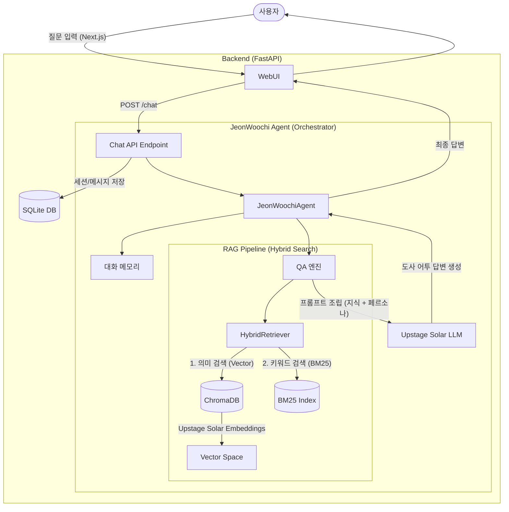

# 📜 전우치 AI 명상소: 답변 생성 아키텍처 보고서

## 1. 시스템 아키텍처 구성도 (Architecture Diagram)

---

## 2. 세부 워크플로우 (Step-by-Step)

### **1단계: 사용자 입력 및 접수 (Frontend & API)**
* 사용자가 웹 UI(Next.js)에서 질문을 입력하면, FastAPI 백엔드의 `/chat` 엔드포인트로 데이터가 전달됩니다.
* 시스템은 즉시 질문 내용을 **SQLite DB**에 저장하여 대화 기록을 영구히 보존합니다.

### **2단계: 하이브리드 검색 (Retrieval)**
단순히 기억력에 의존하지 않고, **`HybridRetriever`**라는 도술을 부려 가장 정확한 근거를 찾아냅니다.
* **의미 검색 (Vector Store)**: 질문의 의도를 파악하여 [knowledge.md](../data/knowledge.md) 등 비급서에서 의미적으로 가장 유사한 내용을 찾아냅니다 (Upstage Solar Embeddings 사용).
* **키워드 검색 (BM25)**: 질문에 포함된 핵심 단어(예: "복식호흡", "불면증")가 정확히 일치하는 지식 조각을 찾아냅니다.
* **병합**: 두 가지 방식의 검색 결과를 결합하여 가장 신뢰도가 높은 **'비급서 조각'**들을 선택합니다.

### **3단계: 컨텍스트 보강 및 프롬프트 조립 (Augmentation)**
* 수집된 지식 조각들을 **`[참고한 비급서]`**라는 이름으로 정리합니다.
* 여기에 **`JeonWoochiPersona`**에 정의된 도사 설정(탈권위적인 도사 어투, 지혜로운 태도 등)을 입힙니다.
* **메모리(Memory)** 시스템이 과거 대화 내용을 요약하여 현재 질문의 맥락을 강화합니다.

### **4단계: 답변 생성 (Generation)**
* 조립된 최종 프롬프트가 **Upstage Solar-pro LLM**에게 전달됩니다.
* AI는 전달받은 비급서 내용에 **엄격히 기반**하여, 전우치 특유의 말투(~하오, ~구려)로 생생한 답변을 생성합니다.

### **5단계: 결과 반환 및 저장 (Response)**
* 생성된 답변은 다시 사용자의 화면에 부드러운 애니메이션(Framer Motion)과 함께 나타납니다.
* 답변 내용 또한 자동으로 DB에 저장되어 다음 대화의 밑거름이 됩니다.

---

## 3. 핵심 기술 특이사항

1. **신뢰할 수 있는 도사 (RAG)**: AI가 마음대로 지어내는 현상을 막기 위해, 반드시 **`비급서`** 내에 있는 정보로만 답하도록 설계되었습니다.
2. **현대와 고전의 조화**: 말투는 조선의 도사이나, 그 내면에는 **Upstage Solar**라는 현대 최첨단 인공지능 엔진이 탑재되어 지식의 깊이가 매우 깊습니다.
3. **지능형 비급 관리**: [knowledge.md](../data/knowledge.md) 파일은 단순한 텍스트가 아니라, 시스템 내부에서 수많은 **ID 기반의 지식 조각**으로 파편화되어 있어 어떤 질문에도 필요한 부분만 쏙쏙 뽑아낼 수 있습니다.
